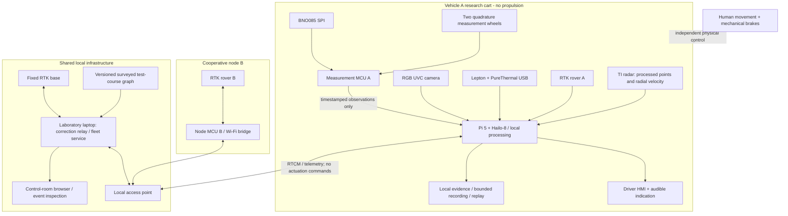

# Flagship system architecture

Revision F0 · 2 October 2026 · Proposed engineering design

## 1. What the flagship physically is

The central artifact is a **removable forward-sensing instrument pod**, with a driver-facing screen, carried on a new braked instrument cart. A person moves and stops the cart. A second person carries a separate GNSS/network node along a marked cooperative route. A fixed RTK station and a laptop display both on a locally stored course map.

The mobile platform is therefore not an attempt to reproduce a dumper's propulsion. It is a controlled way to move a real sensor reference frame, record ego-motion and demonstrate guidance/conflict evidence. It avoids spending this budget on a drivetrain that would still prove nothing about HEMM braking, loading or traction.

The pod mounting plate is removable for a future, separately authorized shadow-mode vehicle trial. That later installation requires vehicle-specific mounting, supply, environmental and operational review. It is not approved by this document.

### Alternatives considered for the demonstrator

| Architecture | Strength | Limitation | Decision |
|---|---|---|---|
| Old hobby robot | Already exists | Wrong payload/geometry basis; explicitly excluded by user | Not used |
| Small commercial powered UGV | Visible self-propelled motion; encoder-equipped options exist | Entire power/pod/mast payload and raised centre of gravity need verification; skid slip and new motor integration consume effort | Not selected |
| New custom powered rover | Can be sized to payload | Motors, brakes, battery, protection and supervisory verification compete with sensing budget | Not selected for this driver-assistance study |
| Borrowed road vehicle | Real mounting height and vehicle dynamics | Access, insurance, operator/site approval, supply transients and safety exposure are not established | Later shadow-mode validation only |
| New human-operated instrument cart | Repeatable low-speed sensing, sufficient custom payload envelope, inspectable protection, removable pod | No actuation/braking proof; operator ergonomics differ from a cab | **Selected** |

Waveshare UGV01's manufacturer lists a 6.2 kg driving payload. That is a relevant candidate, not a measured guarantee for a tall sensor mast. With the selected power station alone approximately 3.5 kg, a full mounted payload has little unverified margin. This is a mass/centre-of-gravity consideration, not a claim that the commercial UGV is defective. [UGV01](https://www.waveshare.com/product/robotics/mobile-robots/ugv01.htm), [power station](https://ecoflowindia.com/collections/river-series-2/products/ecoflow-river-2-portable-power-station-256wh)

## 2. Three distinct architecture layers

**A — complete student demonstrator:** pod, research cart, power station, HMI, motion wheels, node B, base, local AP, control-room laptop access and test fixtures. These together form the project budget.

**B — per-vehicle function set:** forward radar/RGB/thermal, edge inference and recording, GNSS/IMU, appropriate vehicle-motion input, operator display/alert, protected vehicle supply, authenticated telemetry and calibrated mount. The student cart, power station and laboratory fixtures are not replicated on every dumper.

**C — shared mine infrastructure:** correction network/base stations, surveyed road graph, RF coverage, fleet services, control room, event archive, calibration resources and maintenance process. One base is sufficient for this small test course only; the mine-scale count requires a coverage/error study.

## 3. Operating domain

All numbers here are **proposed test limits/targets**, not field-validated capability.

| Dimension | Initial research domain | Explicitly outside this release |
|---|---|---|
| Platform | Human-operated cart, no rider; segregated level hard surface | Powered haulage or road use |
| Speed | Initially stationary, then at most 1 m/s after mechanical review | Dumper speed/braking equivalence |
| Geometry | Forward targets at measured 1–15 m stations; use only validated subsets | Guaranteed 15 m detection or full 360-degree coverage |
| Targets | Reflector, static inert obstacles, controlled warm target; supervised walking target only with separation | People relying on TARK to avoid collision |
| Weather | Dry electronics; daylight/shade; controlled optical obscuration with venue approval | Rain, condensation, mud, mine dust, lightning or explosive atmospheres |
| Localization | Open-sky outdoor test area with fixed base and surveyed/marked reference | Guaranteed RTK indoors, beside high walls or in an actual pit |
| Cooperation | Two physical location nodes on the same surveyed/relative course | Uninstrumented hidden vehicles, guaranteed communication through a hill |
| Demonstration venue | Outdoor GNSS demonstration; labelled recording/replay indoors | Invented indoor RTK fixes |

The full mine-use objective remains larger than this domain. A scientifically constrained physical demonstration is evidence toward that objective, not proof of all-weather mine readiness.

## 4. System block diagram

This is a logical block diagram, not an electrical netlist. An arrow never implies power compatibility, shared ground or a released pin assignment.

## 5. Local and shared responsibilities

The main node acquires, timestamps, validates and stores its own evidence. It must remain able to display local sensing and loss-of-capability status without internet or the control-room laptop. Peer conflicts require fresh peer data; a failed link must remove confidence, not manufacture a clear route.

The shared laptop forwards correction data, manages the test-course graph, records fleet telemetry and provides the larger supervisor view. It is not a motor authority. In the prototype it also hosts base services; in industrial deployment those services should not depend on an operator closing a laptop lid.

Node B deliberately has positioning and communication only. It is **not represented as a second fully instrumented TARK vehicle**. It supplies the minimum independent physical evidence needed for a two-participant conflict experiment. More fleet nodes may be simulated, but must remain visually and persistently labelled as such.

## 6. Evidence, not sensor-count novelty

| Desired capability | Hardware support | Required evidence/limitation |
|---|---|---|
| Radar obstacle geometry | Documented point-cloud radar, rigid calibrated mount | Per-profile range/angle/Doppler validation; a point is not a classified object |
| RGB semantics | Dedicated low-light UVC camera + inference accelerator | Recorded labels, errors and model/version; no promise to see through fog |
| Thermal corroboration | Real LWIR core and USB bridge | Spatial/time alignment and shutter-state handling; no thermal-only ranging |
| Source freshness | MCU timestamps, host monotonic clock, receiver time where supplied | Clock mapping and transport delay bounds; arrival time is not exposure time |
| Motion plausibility | Two measurement wheels + gyro/accelerometer + GNSS | Slip/disagreement retained; wheels are not absolute ground truth |
| Precise road localization | RTK rover/base, antenna mounts, reference course | Datum, lever arms, correction age, ambiguity and uncertainty preserved |
| Guidance | Local road graph, HMI and location | Turn cue suppressed when road association is ambiguous |
| Blind-curve awareness | Independent node B, shared coordinates and timestamps | Cooperative conflict only; radar cannot infer an unseen hill's far side |
| Explainable states | Local logging/storage and complete metadata | Save why evidence was accepted/rejected, not just final colour/state |
| Offline operation | Local compute, AP and local map | Internet-free does not mean radio-failure-proof |

## 7. Driver and control-room hardware

The driver display sits at the push handle, not behind the forward sensor aperture. It shows research state, primary reason, available evidence, source ages, speed estimate and turn cue. A permanent **RESEARCH / NO AUTOMATIC BRAKING** label must be visible. An audible alert supplements text/symbols; it is not an industrial cab siren specification.

The control room uses a laboratory laptop, minimum practical target: contemporary 4-core x86-64 processor, 8 GB RAM, 256 GB SSD, functioning Ethernet/Wi-Fi, USB and supported OS/browser. Manufacturer/model is an access-allocation fact still to record, not an invented purchased asset. It runs base/fleet services and the operator browser. A projector is optional venue equipment, not hidden in the BOM.

## 8. Physical safety boundary

There is no powered drivetrain, motor driver or brake actuator in this design. No GPIO has motor authority. A physical equipment-power disconnect removes electrical supply independently of the UI, but **does not stop the cart**. The human operator and mechanical service/parking brakes handle motion.

TI's EVM guide explicitly excludes functional-safety/safety-critical evaluation use. The selected board is consequently confined to non-safety measurement and shadow decision research; no person's protection may depend on its detection or warning. The research label is not permission to ignore that restriction. [TI EVM guide, use restrictions](https://www.ti.com/lit/ug/swru546/swru546.pdf)

## 9. What the clean-sheet reset does not magically complete

The selected Hailo inference runtime, TI radar profile/decoder, Lepton frame path, BNO085 acquisition, two measurement-wheel channels and RTK correction relay must be integrated and tested later. Existing software maturity cannot be inherited from an old BOM. This task writes no implementation and makes no claim that these new parts already work with the frozen application.

The existing traction policy remains untouched. No request here authorizes replacing `DISABLED_PHASE_1`, altering existing safety/control code or starting a powered hardware test.
