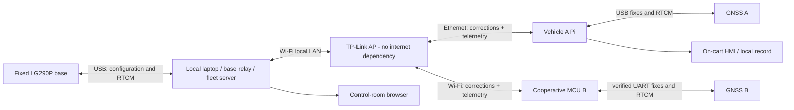
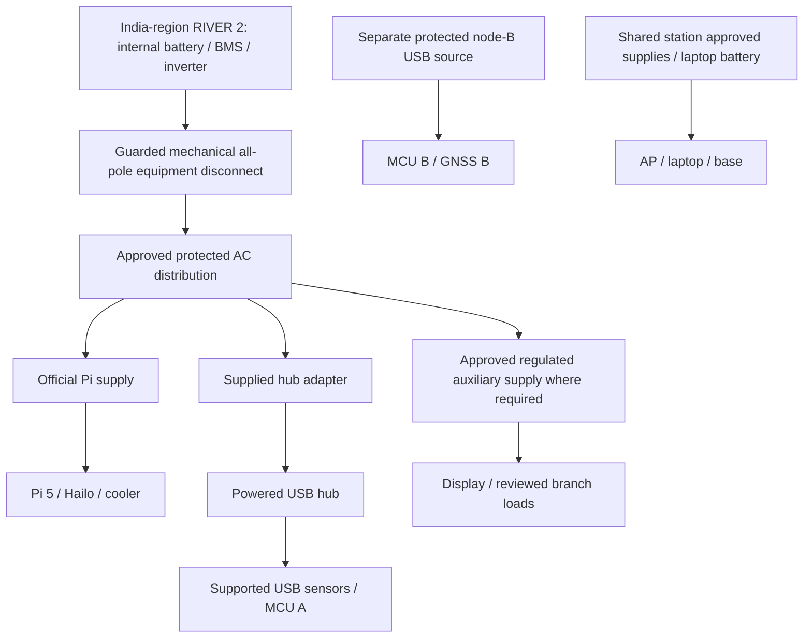

# Interfaces, power, mechanical layout and protection

Revision F0 · Architecture-level design only — NOT a wiring/energization instruction

No old pin number, fuse net, wheel mount or battery assumption carries into this document. Exact connector pinouts and protection ratings are held at the release gates until the selected revisions and load measurements support them.

## 1. Main-node physical topology

```text
FRONT / direction of travel
          [RTK antenna above sensor crossbar]
  [RGB]       [RADAR aperture]       [LWIR]
       rigid common plate / axis marks
                    |
             braced, adjustable mast
                    |
       [Pi + Hailo] [hub] [measurement MCU/IMU]
       ventilated guarded electronics compartment
       [enclosed power station low in chassis]
       [separate guarded AC distribution compartment]
  [left measurement wheel]     [right measurement wheel]
                    |
          rear-facing operator HMI
        push handle / mechanical brake lever
REAR / operator position
```

This arrangement is schematic, not to scale. The measurement wheels may be the two fixed load-bearing wheels provided their axles/bearings isolate the encoders from load. Two swivelling support wheels complete the cart. The drawing does not prescribe front/rear axle placement independently of the final stability/brake design.

### Initial mechanical design envelope

| Feature | Proposed design target | What must be verified |
|---|---|---|
| Cart footprint | Approximately 700×500 mm, excluding handle | CAD fit and access; these are new design targets, not measured owned dimensions |
| Wheel diameter | Approximately 150 mm for the two measured wheels | Actual loaded rolling circumference, bearing/shaft and brake compatibility |
| Payload design requirement | At least 15 kg safely supported; no rider | Fabricator load/stability assessment including full assembly and mast |
| Sensor height adjustment | Approximately 0.8–1.2 m above floor | Stability at maximum setting, operator separation and actual target geometry |
| Antenna placement | Above local metal/pod obstructions, stable lever arm | Antenna manufacturer's ground-plane requirements and multipath checks |
| Sensor plate | Rigid aluminium plate/bracket with independently adjustable boresights | Flex, aperture clearance, repeatability after removal |
| Enclosures | Guarded, ventilated, splash-avoiding placement | No IP rating claimed; thermal run and cable-strain inspection required |
| Motion | Human push only, ≤1 m/s initial course limit | Independent mechanical service brake, parking brake and operator control |

Do not buy wheels and then force the encoder onto them. Design the new bearing-supported axle around a sleeve supported by AMT102-V. Encoder stators attach to rigid brackets; rotor adapters turn with the axle. Follow manufacturer axial-clearance and assembly instructions, not an invented magnet gap. Use a keyed/captive attachment or otherwise validated no-slip coupling, mark it for inspection, and guard rotating hardware.

Record measured component masses and centre-of-gravity coordinates. Compute assembled centre of gravity from sum(m_i×r_i)/sum(m_i). Evaluate the actual support polygon, braking/pushing force and mast deflection. A nominal platform payload label alone does not establish anti-tip stability. Mechanical release precedes mobile tests.

## 2. Sensor geometry and mounting

Define body frame x forward, y left, z up. Store each sensor's position and rotation relative to a marked body datum. The local map uses an explicitly declared ENU origin and coordinate reference; radar x/y are never latitude/longitude.

- Put radar near the forward centreline, away from brackets in its antenna field. Its nominal antenna coverage is not a calibrated detection envelope. Follow the EVM's documented separation/handling restrictions.
- Mount RGB and thermal close enough for useful overlapping coverage but with distinct measured extrinsics. Their fields of view differ. Do not stretch thermal into an apparently exact RGB overlay.
- Use lens hoods rather than uncharacterized windows. Ordinary glazing must not be placed over the LWIR aperture. Any radar radome material/thickness is a measured RF change, not a cosmetic cover.
- Keep the IMU on the rigid body, away from moving mounts, steel/magnets and large current loops. Log its orientation and calibration state. Use gyro-based motion with explicit drift limits; do not silently convert magnetic heading to geographic heading.
- Fix the base antenna to a stable tripod/monument with a repeatable reference mark. Record rover antenna-to-body lever arms. A person carrying node B is not a zero-lever-arm vehicle pose.

## 3. Interface allocation

| Link | Transport / direction | Power and electrical boundary | Runtime evidence needed before claiming integration |
|---|---|---|---|
| RGB → Pi | Direct host USB 3 physical port, camera operates at its supported USB mode; UVC stream | 5 V host supply, specified load checked | Enumerated camera identity, requested format, sequence/timestamps, drop/age counters |
| Powered hub ↔ Pi | Other host USB 3 port | Hub uses its own supplied adapter; no backfeed assumed | Link topology and simultaneous load/throughput test |
| Radar ↔ Pi via hub data port | USB serial CLI and processed data channels | Supported standalone USB power/profile; alternate documented supply route only after power review | Board revision, firmware hash, CLI/profile, exact documented TLV schema, scale/axes and latency |
| PureThermal → Pi via hub | UVC plus supported telemetry/control | 5 V bridge input; Lepton connects only to its bridge | Real raw/temperature format where supported, shutter/frame status and timestamps |
| GNSS A ↔ Pi via hub | USB serial normalized fixes; RTCM routed back | Kit USB 5 V; supplied active antenna | Receiver firmware, fix/correction state, source time and coordinate reference |
| MCU A ↔ Pi via hub | USB observation transport | USB-powered MCU; no power through GPIO inputs | Identity/version, boot/session, monotonic sample times, bounded queue, missing-sample state |
| BNO085 ↔ MCU A | SPI SCLK/MOSI/MISO/CS plus INT/RST, short internal harness | 3.3 V supply/logic; SPI mode straps per Adafruit guide | Report IDs, sample timing, calibration state, transport error recovery |
| Two AMT102-V → MCU A | Four quadrature A/B signals through two dual buffers; optional index unconnected | Encoders 5 V; SN74LVC2G17 powered at 3.3 V; no raw 5 V into MCU | PPR setting, direction, count/time, invalid transitions, lift/slip tests |
| Pi → driver display | Micro-HDMI to HDMI | Panel has separately verified power; USB touch connection according to exact revision | Display mode, touch/power behavior and readability |
| MCU A → buzzer | Logical attention indication only | Supply/drive per module specification; no pin current assumed | Audible indication and disconnected-fault handling; no safety reliance |
| Pi ↔ local AP | Ethernet | Supplied AP power at shared station | Link/stale indication, reconnect, offline local IP configuration |
| GNSS B ↔ MCU B | GNSS fixes out; RTCM corrections back over documented UART | USB power for board(s); exposed UART logic and connector must be verified before wiring | No duplicate USB/UART drivers; explicit input/output routing and buffer bounds |
| MCU B ↔ AP | Wi-Fi telemetry and correction forwarding | Independent node-B battery package | Unique node/session ID, sequence, timestamps, quality, authentication and loss behavior |
| Base ↔ laptop | USB serial | Laptop USB supply checked against kit requirements | Fixed reference coordinates, RTCM messages, correction age, logging and restart behavior |

GPIO assignments for these **new boards** are deliberately not copied from any old firmware. The detailed carrier drawing must allocate non-conflicting pins, exclude strapping/flash/USB-reserved pins and document physical header identity before assembly. This architecture supplies logical functions, not fictitious finished pin-to-pin drawings.

A new measurement path must not be smuggled into an old motor STATUS schema. Later integration must either use a reviewed versioned observation extension or a clearly separate metrology contract; it must not change motion authority. No communication implementation is written in this task.

## 4. Network and correction topology



The base computes/exports corrections; the laptop is a relay, not an additional GNSS sensor. No subscription NTRIP caster or internet service is needed for the local experiment. A self-surveyed base may support relative consistency while retaining an absolute map offset; do not label it independently surveyed.

Node B must receive correction messages as well as send fixes. Receiving NMEA alone does not complete the RTK architecture. There is no direct hill-penetrating V2V claim: this is cooperative V2I through an AP whose coverage must be tested. Corrected position, telemetry and video have different bandwidth/age requirements. Prioritize bounded telemetry/correction queues; do not flood the peer link with raw video.

Example planning load, not a measured throughput result: 200 bytes per node update ×10 Hz = 2 kB/s per node payload. At 100 nodes that is 200 kB/s before transport/security overhead; all-to-all unicast would scale far worse. Use spatial subscription/aggregation at the mine server, with local decisions continuing independently. Determine actual traffic from the implemented contract before RF/network dimensioning.

## 5. Power architecture

The prototype uses an enclosed commercial battery/inverter to avoid designing a new cell pack/BMS/charger. This introduces mains voltage inside a guarded compartment and therefore requires a qualified electrical assembly review. It is **not automatically safer merely because it is commercial**.



No cart load is connected to the power station's unswitched USB/DC outputs in parallel with this topology. Thus the external equipment disconnect does not leave those loads powered by an accidental second path. Node B and the shared station remain separate power domains with their own isolation. The station's internal battery remains energized after external isolation; the enclosure must not be opened.

### Protection principles, not invented fuse values

1. Preserve the power station's internal protection and charger. No new lithium pack, cell tapping or guessed charge profile.
2. Choose distribution/disconnect parts rated for the actual regional inverter output, combined load, inrush, conductor size and disconnection duty. The exact all-pole device and fuse/MCB values remain a documented electrical-design gate.
3. The inverter's neutral/earth arrangement and any RCD behavior must be checked against its exact manual. Do not add an ad-hoc neutral-earth bond or promise that a generic RCD guarantees protection on a floating source.
4. Keep mains inaccessible, strain-relieved and segregated from signal wiring. Use approved enclosed supplies; no exposed mains terminal boards or student-built inverter.
5. For each low-voltage branch verify maximum current, voltage drop, connector/cable rating, load transients and upstream current limiting. Software current estimates never replace wire protection.
6. Identify USB backfeed paths during review. Do not splice an auxiliary supply into a live USB cable or connect two regulated outputs together. Any radar supplemental-power harness needs its revision-specific documented connection and isolation arrangement approved first.
7. Charging occurs stationary in a suitable dry location using the exact manufacturer's instructions. Demonstrations run untethered; no dragging mains extension cable.
8. Electrical isolation can lose data. Normal shutdown must flush records first; emergency isolation takes precedence over logging. These are different operator actions.

For radar, initially use a documented standalone USB-supported profile. Do not promise a high-power beamforming profile on ordinary USB power. If the required profile exceeds that boundary, review the documented supplemental-power route and budget before use; no uncosted MMWAVEICBOOST is assumed.

### Power sizing worksheet

| Load grouping | Design allowance W | Nature |
|---|---:|---|
| Pi + HAT + cooler | 27 | Supply-capacity planning, not measured consumption |
| Radar | 10 | Conservative reservation; exact profile/power route pending |
| RGB | 1.5 | Vendor maximum current ×5 V |
| Thermal bridge + core | 3 | Integration allowance |
| Main GNSS + MCU + IMU + encoders | 5 | Integration allowance |
| HMI | 8 | Integration allowance; delivered revision to measure |
| Hub, conversion losses and remaining small loads | 10 | Integration allowance |
| **Total load-side planning** | **64.5** | Not a measured energy result |

Use an 80 W battery-side planning scenario to allow conversion/idle loss. With 256 Wh nominal energy and a deliberately assumed usable factor 0.75, illustrative duration = 256×0.75/80 = **2.4 h**. At 100 W, it is 1.92 h. Temperature, battery condition, inverter idle load and chosen streams change this. A ≥90-minute continuous demonstration is an acceptance target, not a product runtime claim. Shared laptop/AP and node-B energy are outside this cart estimate and separately budgeted.

## 6. Wheel-response calculation

For encoder resolution P pulses/revolution, explicitly record whether the counter uses ×1 or ×4 decoding. With ×4 quadrature, loaded wheel circumference C and valid count increment delta_n:

`wheel_distance = delta_n * C / (4*P)`

`wheel_speed = wheel_distance / measured_delta_time`

Example only: a nominal 150 mm wheel and P=1024 gives approximately 0.115 mm/count geometrically. That is **resolution, not measurement accuracy**. At 1 m/s the combined quadrature count rate is approximately 8.69 kcounts/s per wheel. Verify counter capacity, bounce/noise rejection and timing with synthetic signals before rolling tests.

For two parallel wheels separated by measured track b, the rolling-model yaw increment is approximately `(distance_right-distance_left)/b`, with sign fixed by the chosen axes. Compare it with gyro motion; don't trust it through lateral slip, wheel lift or a moving caster alignment. GNSS and wheel disagreement is evidence to retain, not a reason to force a plausible speed.

## 7. Cable and port schedule

- Main Pi: one direct RGB USB link, one powered-hub uplink, micro-HDMI display and Ethernet AP link.
- Hub data ports: radar, thermal bridge, GNSS A, measurement MCU A and display touch as supported. Leave spare data ports; charge-only sockets are never counted as data capacity.
- Separate station: base USB-C data cable to laptop; AP supplied power cable.
- Node B: power-bank leads to its board package; short reviewed UART harness inside enclosure. No unreviewed dual powering through programming and battery USB.
- Thermal and GNSS A/base need three suitable USB-C data leads; radar uses its actual delivered connector type. MCU A and service access use the documented board connector. F18 covers remaining cables, not a claim that every product bundles them.
- Internal SPI/quadrature cables are short, restrained and keyed/labelled where practical. Sensor signal ground continuity is established by the interface design; chassis is not assumed to be every circuit's return.

## 8. Timing architecture

Keep device sample time, host receipt time, sequence/boot identity and processing/publication time distinct. GNSS UTC does not automatically synchronize UVC exposure or radar chirps. Where a verified PPS output is available, design a documented capture input later; no pin or hard-synchronization claim is released here. Otherwise estimate clock offsets/uncertainty and limit fusion by measured alignment quality. Store the residual uncertainty in event evidence.
