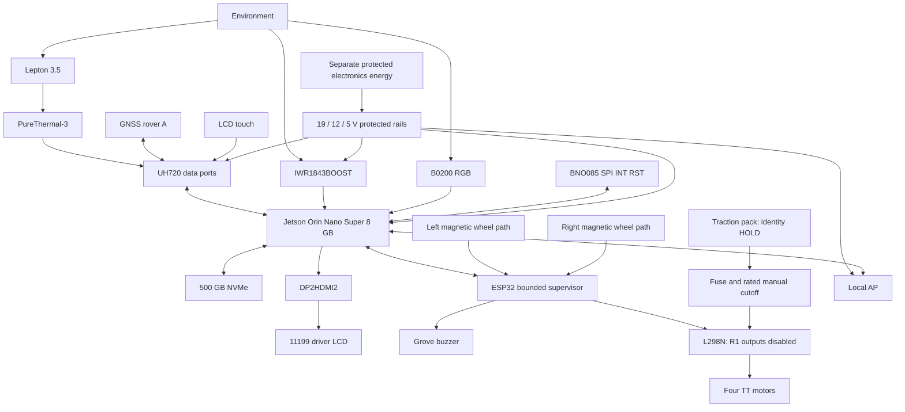
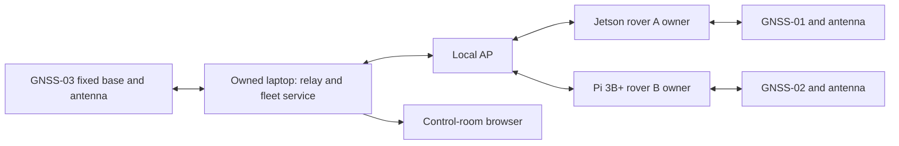
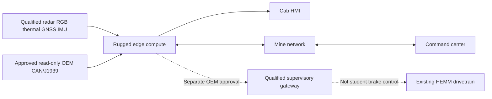

# 01 — Complete system architecture

Revision M2-E1 | 1 October 2026 | DESIGN ONLY, NOT AS-BUILT

## Authority and maturity

This is the detailed Master Engineering Prompt 2 package. It expands the earlier short handoff without editing it. [Master-1](../tark-r2-master/12_MASTER_FREEZE_CHECKPOINT.md) controls hardware; the latest wheel/GPIO/regional-SKU clarifications prevail. [R1 status](../PROJECT_STATUS.md) controls implementation claims. New R2 functions below are design requirements, not implemented or measured results. No code, firmware, configuration, PPT or physical hardware is changed.

Frozen: Orin Nano Super 8 GB platform, IWR1843BOOST, B0200 IMX291, Lepton 3.5 500-0771-01/PURETHERMAL-3, BNO085 4754 SPI, three Waveshare 33000 kits, two 14-bit SPI wheel paths, owned ESP32-S3, Waveshare 11199, SNV3S/500G, UH720 V5.0, TL-WR902AC V3, Grove 107020000, DP2HDMI2, four UGREEN 60116 cables and existing L298N/four TT/acrylic chassis. No premium additions.

## A. Main vehicle

Functional arrows are not final wires. USB bus power/returns and host-derived logic supplies are resolved in [04](04_POWER_ARCHITECTURE.md) and [38](38_CIRCUIT_AND_INTERCONNECT_DIAGRAMS.md).

## B. Peer and C. Base/control room

One process owns each receiver, multiplexing documented correction/configuration writes and data reads. The Pi is a carried/cart peer, not another perception computer or motor authority. The laptop owns base corrections and fleet aggregation; the Jetson retains local decisions. Browser processes never own serial devices. AP travels with the model using short Ethernet to Jetson; peer/laptop use Wi-Fi.

Four Jetson USB hosts: U1 radar, U2 RGB, U3 ESP32, U4 hub. Hub D1 thermal, D2 rover A, D3 touch/display (power subject to budget verification). Seven data ports are distinct from charge-only ports. Four M15 cables serve three GNSS kits and thermal. Remaining leads use package inventory/R04, not hidden purchases.

## D. Industrial functional mapping

## Authority

| Subsystems | Class | Boundary |
|---|---|---|
| Radar/RGB/thermal/IMU/wheels | OBSERVATION | Measurements and health only |
| GNSS/base/map/peer state | CONTEXT | No clearance or motor grant |
| Jetson local pipeline | DECISION SUPPORT | State and bounded request within phase |
| ESP32 | LOCAL SUPERVISION | Session, bounds, expiry and local conditions |
| L298N/TT | MOTION OUTPUT | Current applied outputs zero |
| Rated manual disconnect | PHYSICAL POWER INTERRUPTION | Independent motor-energy removal |
| Driver LCD/buzzer | DECISION SUPPORT | Present warnings, not calculate authority |
| Laptop/browser | MONITORING / CONTEXT | Inspect and reviewed mission context, never direct drive |
| AP/hub/SSD/power | Supporting infrastructure | Carry/store/power assigned functions; no authority |
| References/owned webcam/LD2450 | TEST / CALIBRATION | Separate labelled bench evidence |

Acquisition → time/health → observations → tracking/fusion/localization → route/peer context → risk/envelope → state/reason → HMI and bounded endpoint request. Logging observes the complete chain. Replay is isolated from hardware. No observer polling drives the decision loop.

Scheduling targets, not measurements: RGB capture ~30 Hz/inference initially 10 Hz; thermal 8.7 Hz; GNSS 5–10 Hz; IMU inertial 100/orientation 50 Hz; wheels 100 Hz; decisions 20 Hz; fleet 10 Hz; HMI 5–10 Hz. Radar rate follows qualified firmware/profile. Missing deadlines reduce capability. Current traction remains DISABLED_PHASE_1.

Hardware evidence: [NVIDIA layout](https://docs.nvidia.com/jetson/orin-nano-devkit/user-guide/latest/hardware_layout.html), [M1 source register](../tark-r2-master/03_EXACT_COMPONENT_FREEZE.md).
