# 37 — Flowchart package

All 22 diagrams are design flows, not proof of implementation. Arrows indicate data/control dependency, not physical wiring. Current Phase-1 outputs remain zero. The authoritative detailed contracts are documents 07–24.

## 1. Entire TARK system

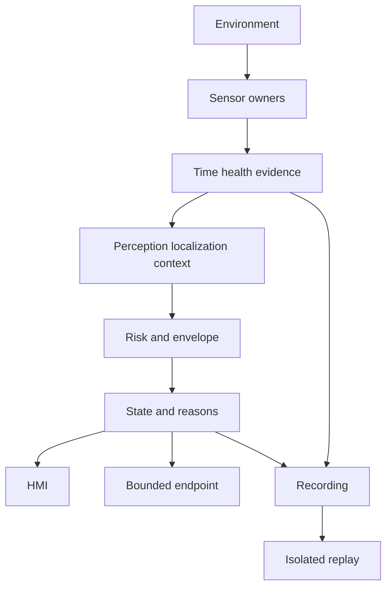
```mermaid
flowchart TD
  ENV["Environment"] --> ACQ["Sensor owners"] --> EV["Time health evidence"] --> P["Perception localization context"] --> R["Risk and envelope"] --> ST["State and reasons"] --> H["HMI"]
  ST --> EP["Bounded endpoint"]
  EV --> REC["Recording"]
  ST --> REC
  REC --> REP["Isolated replay"]
```

## 2. Sensor acquisition

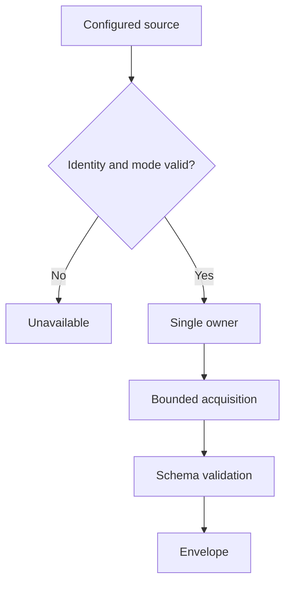
```mermaid
flowchart TD
  CFG["Configured source"] --> ID{"Identity and mode valid?"}
  ID -->|No| U["Unavailable"]
  ID -->|Yes| OWNER["Single owner"] --> RAW["Bounded acquisition"] --> V["Schema validation"] --> O["Envelope"]
```

## 3. Evidence health

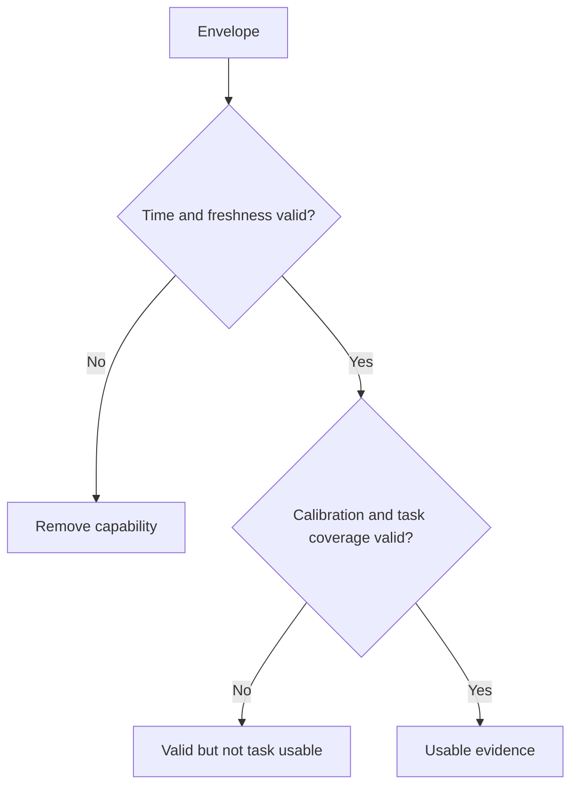
```mermaid
flowchart TD
  E["Envelope"] --> T{"Time and freshness valid?"}
  T -->|No| LOST["Remove capability"]
  T -->|Yes| C{"Calibration and task coverage valid?"}
  C -->|No| LIMITED["Valid but not task usable"]
  C -->|Yes| USE["Usable evidence"]
```

## 4. Radar processing

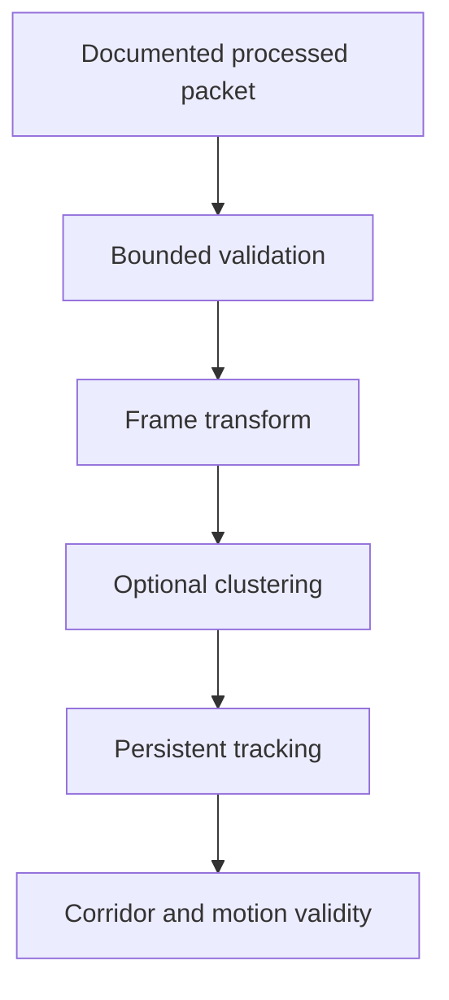
```mermaid
flowchart TD
  PKT["Documented processed packet"] --> V["Bounded validation"] --> TF["Frame transform"] --> CL["Optional clustering"] --> TR["Persistent tracking"] --> REL["Corridor and motion validity"]
```

## 5. RGB processing

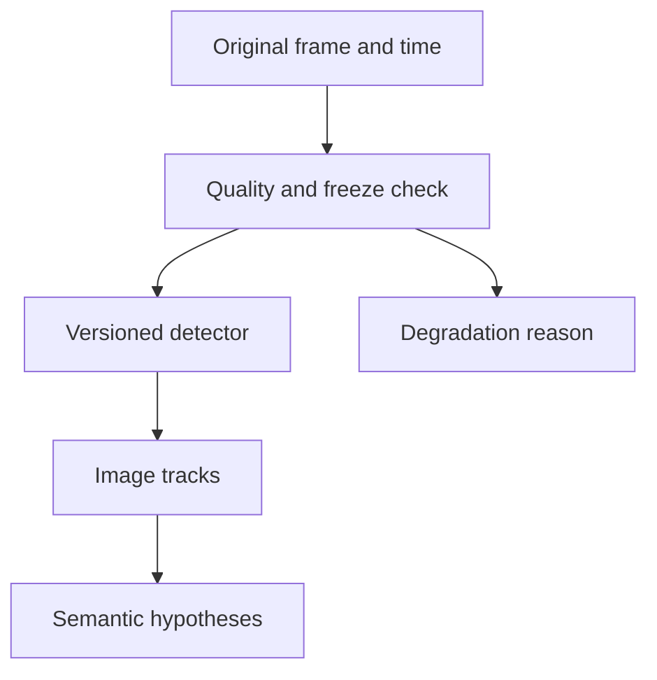
```mermaid
flowchart TD
  F["Original frame and time"] --> Q["Quality and freeze check"] --> DET["Versioned detector"] --> TRACK["Image tracks"] --> SEM["Semantic hypotheses"]
  Q --> BAD["Degradation reason"]
```

## 6. Thermal processing

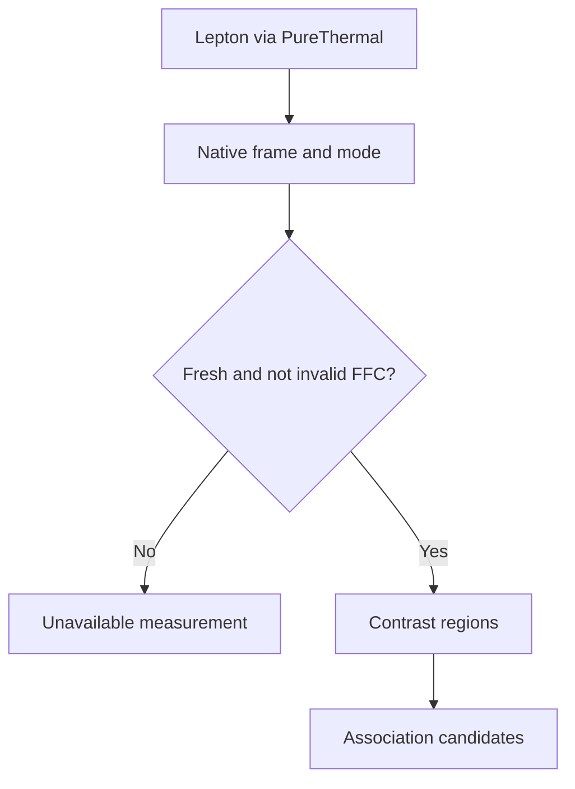
```mermaid
flowchart TD
  CORE["Lepton via PureThermal"] --> FRAME["Native frame and mode"] --> FFC{"Fresh and not invalid FFC?"}
  FFC -->|No| U["Unavailable measurement"]
  FFC -->|Yes| REG["Contrast regions"] --> ASSOC["Association candidates"]
```

## 7. Sensor association

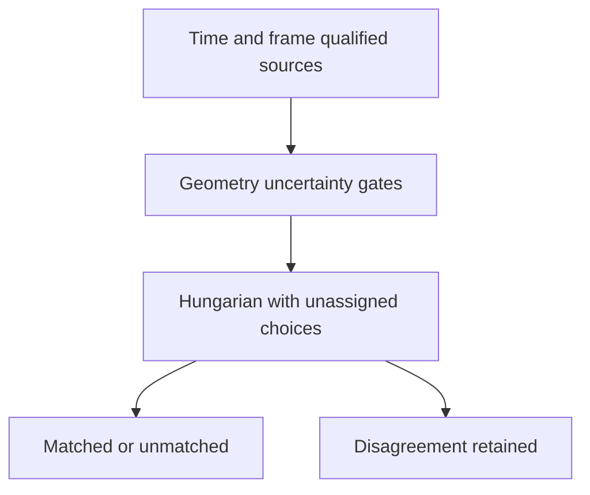
```mermaid
flowchart TD
  S["Time and frame qualified sources"] --> G["Geometry uncertainty gates"] --> H["Hungarian with unassigned choices"] --> M["Matched or unmatched"]
  H --> D["Disagreement retained"]
```

## 8. Tracking

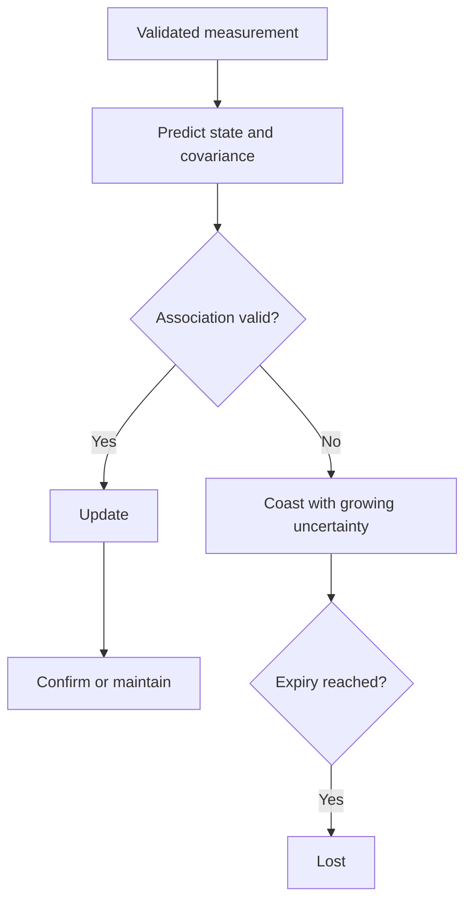
```mermaid
flowchart TD
  Z["Validated measurement"] --> P["Predict state and covariance"] --> A{"Association valid?"}
  A -->|Yes| U["Update"] --> C["Confirm or maintain"]
  A -->|No| CO["Coast with growing uncertainty"] --> L{"Expiry reached?"}
  L -->|Yes| LOST["Lost"]
```

## 9. Localization

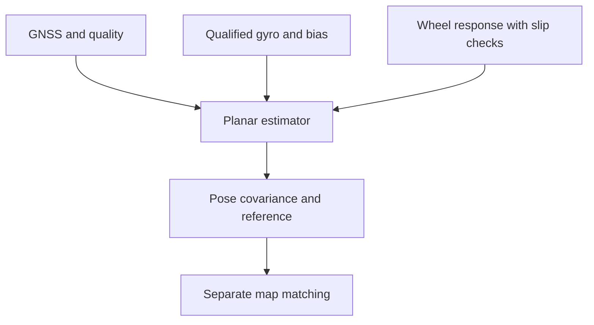
```mermaid
flowchart TD
  G["GNSS and quality"] --> EKF["Planar estimator"]
  I["Qualified gyro and bias"] --> EKF
  W["Wheel response with slip checks"] --> EKF
  EKF --> P["Pose covariance and reference"] --> MM["Separate map matching"]
```

## 10. Map matching

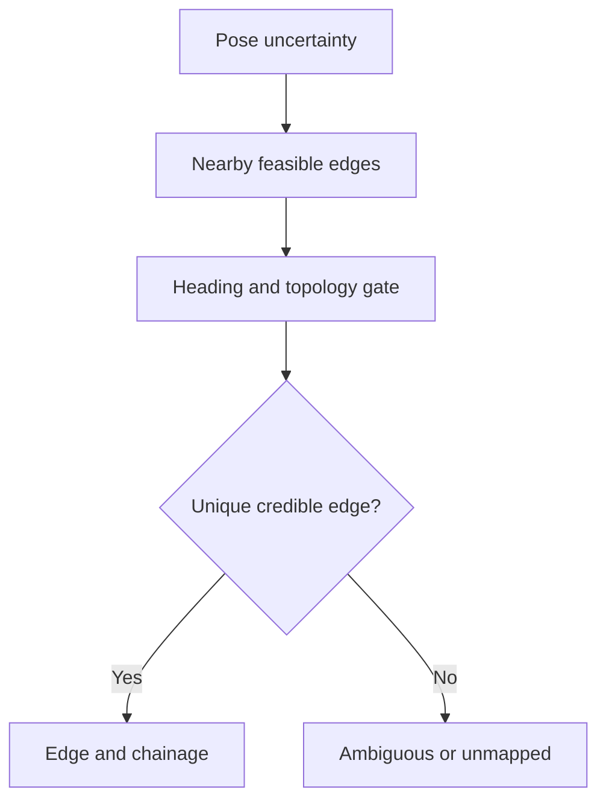
```mermaid
flowchart TD
  P["Pose uncertainty"] --> C["Nearby feasible edges"] --> H["Heading and topology gate"] --> U{"Unique credible edge?"}
  U -->|Yes| E["Edge and chainage"]
  U -->|No| A["Ambiguous or unmapped"]
```

## 11. Route planning

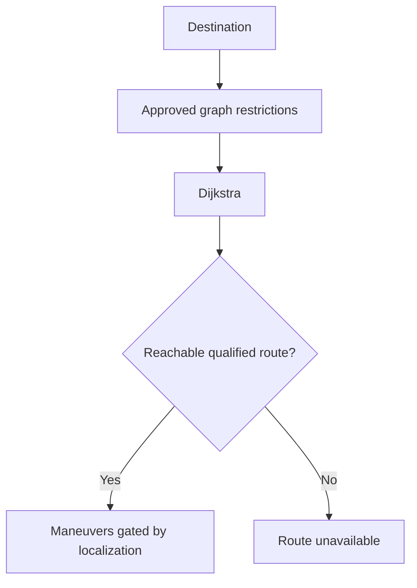
```mermaid
flowchart TD
  D["Destination"] --> G["Approved graph restrictions"] --> DIJ["Dijkstra"] --> R{"Reachable qualified route?"}
  R -->|Yes| M["Maneuvers gated by localization"]
  R -->|No| N["Route unavailable"]
```

## 12. Fleet telemetry

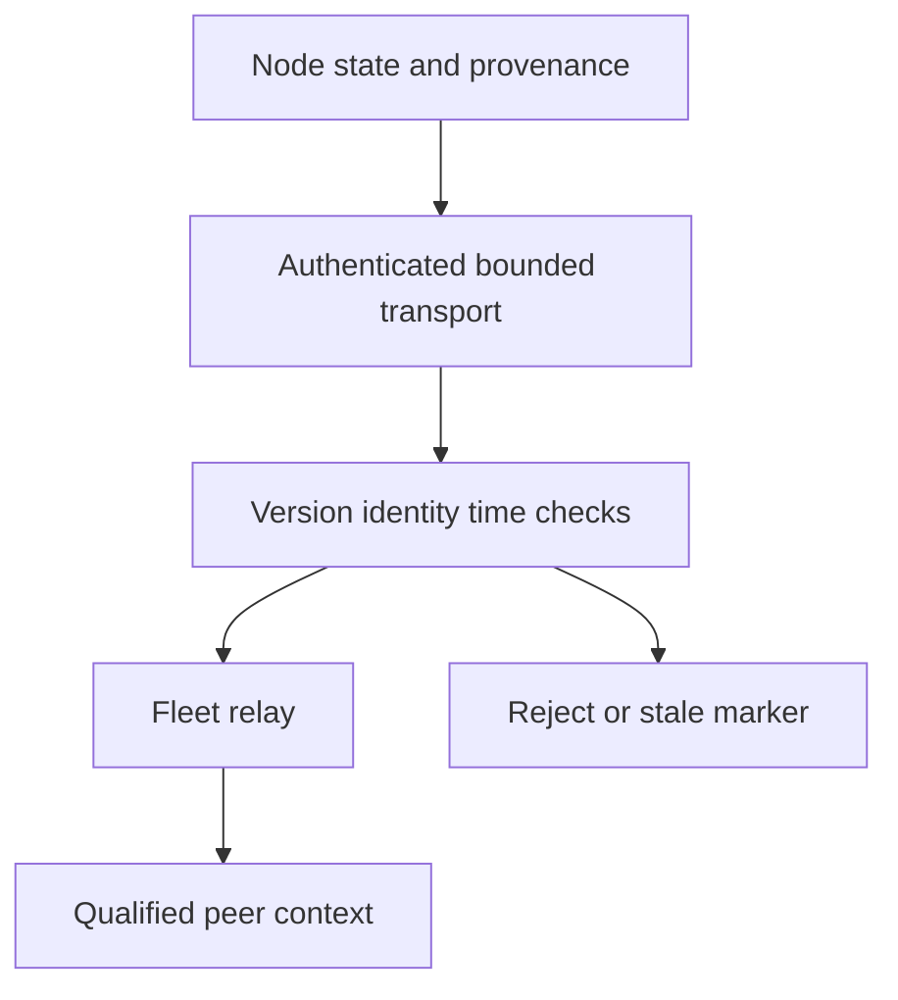
```mermaid
flowchart TD
  NODE["Node state and provenance"] --> AUTH["Authenticated bounded transport"] --> VALID["Version identity time checks"] --> RELAY["Fleet relay"] --> PEER["Qualified peer context"]
  VALID --> BAD["Reject or stale marker"]
```

## 13. Blind-curve conflict

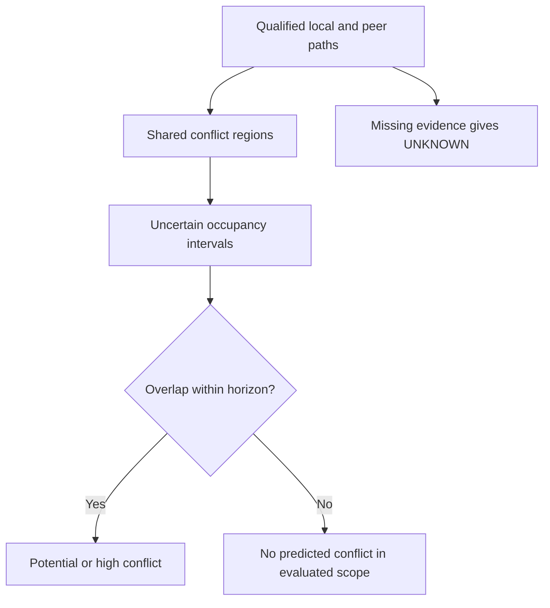
```mermaid
flowchart TD
  PEER["Qualified local and peer paths"] --> REG["Shared conflict regions"] --> INT["Uncertain occupancy intervals"] --> OVER{"Overlap within horizon?"}
  OVER -->|Yes| WARN["Potential or high conflict"]
  OVER -->|No| NC["No predicted conflict in evaluated scope"]
  PEER --> UNK["Missing evidence gives UNKNOWN"]
```

## 14. TTC and CPA

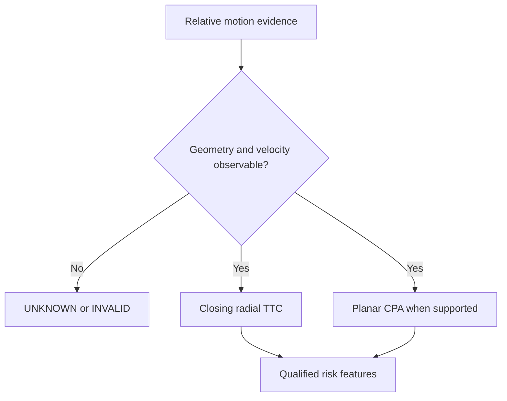
```mermaid
flowchart TD
  M["Relative motion evidence"] --> G{"Geometry and velocity observable?"}
  G -->|No| U["UNKNOWN or INVALID"]
  G -->|Yes| TTC["Closing radial TTC"]
  G -->|Yes| CPA["Planar CPA when supported"]
  TTC --> R["Qualified risk features"]
  CPA --> R
```

## 15. Stopping calculation

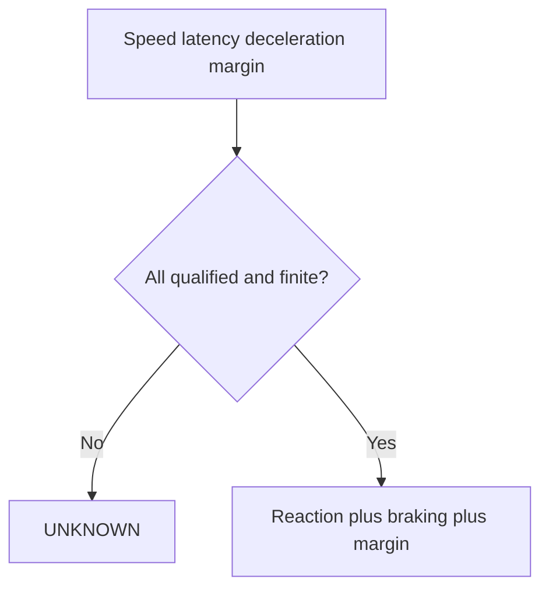
```mermaid
flowchart TD
  I["Speed latency deceleration margin"] --> V{"All qualified and finite?"}
  V -->|No| U["UNKNOWN"]
  V -->|Yes| D["Reaction plus braking plus margin"]
```

## 16. Supported operating envelope

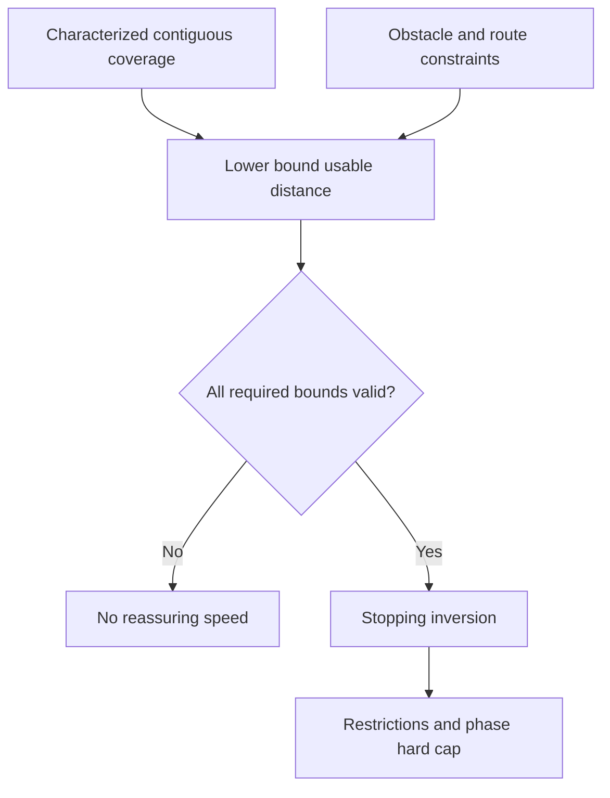
```mermaid
flowchart TD
  C["Characterized contiguous coverage"] --> D["Lower bound usable distance"]
  O["Obstacle and route constraints"] --> D
  D --> Q{"All required bounds valid?"}
  Q -->|No| U["No reassuring speed"]
  Q -->|Yes| INV["Stopping inversion"] --> CAP["Restrictions and phase hard cap"]
```

## 17. State machine

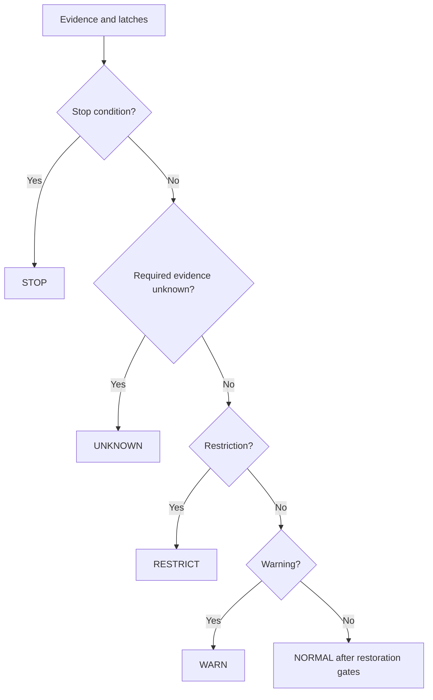
```mermaid
flowchart TD
  E["Evidence and latches"] --> S{"Stop condition?"}
  S -->|Yes| STOP["STOP"]
  S -->|No| U{"Required evidence unknown?"}
  U -->|Yes| UNKNOWN["UNKNOWN"]
  U -->|No| R{"Restriction?"}
  R -->|Yes| RESTRICT["RESTRICT"]
  R -->|No| W{"Warning?"}
  W -->|Yes| WARN["WARN"]
  W -->|No| N["NORMAL after restoration gates"]
```

## 18. Local command and expiry

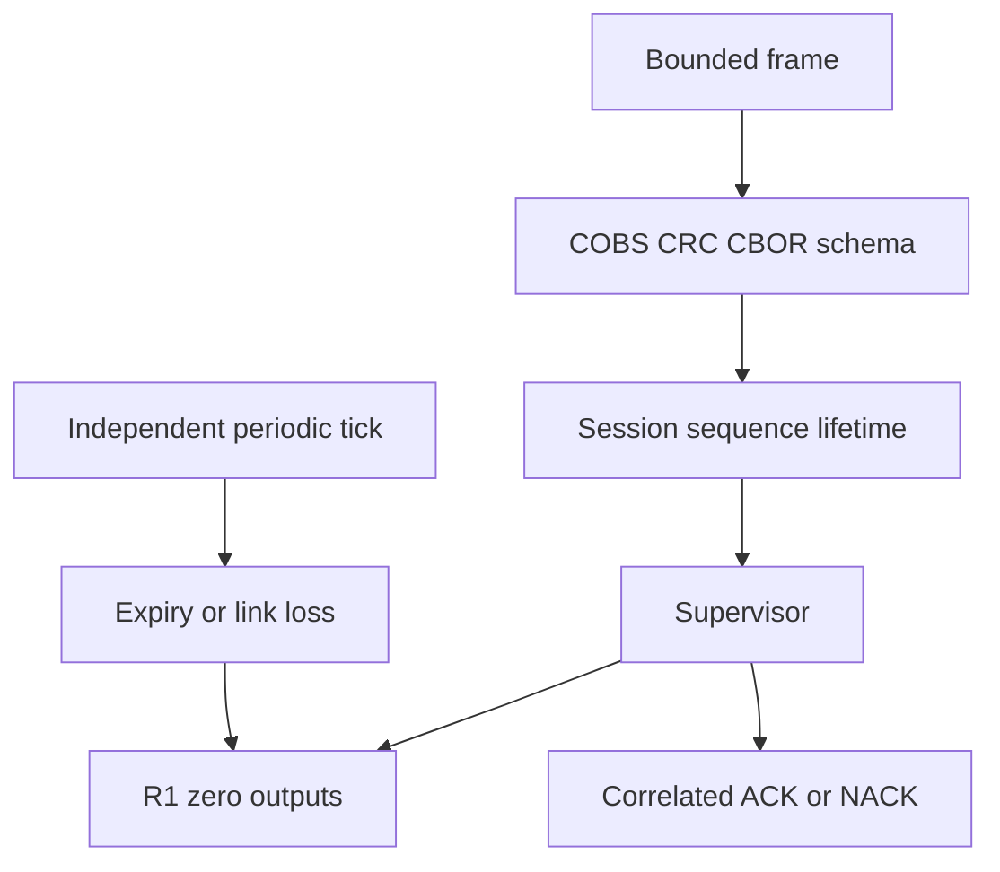
```mermaid
flowchart TD
  RX["Bounded frame"] --> C["COBS CRC CBOR schema"] --> S["Session sequence lifetime"] --> SUP["Supervisor"] --> OUT["R1 zero outputs"]
  TICK["Independent periodic tick"] --> EXP["Expiry or link loss"] --> OUT
  SUP --> ACK["Correlated ACK or NACK"]
```

## 19. Incident recording

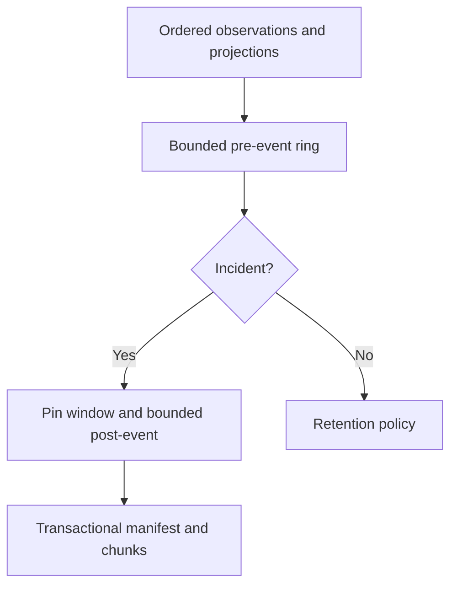
```mermaid
flowchart TD
  IN["Ordered observations and projections"] --> RING["Bounded pre-event ring"] --> TRIG{"Incident?"}
  TRIG -->|Yes| PIN["Pin window and bounded post-event"] --> COMMIT["Transactional manifest and chunks"]
  TRIG -->|No| RET["Retention policy"]
```

## 20. Replay

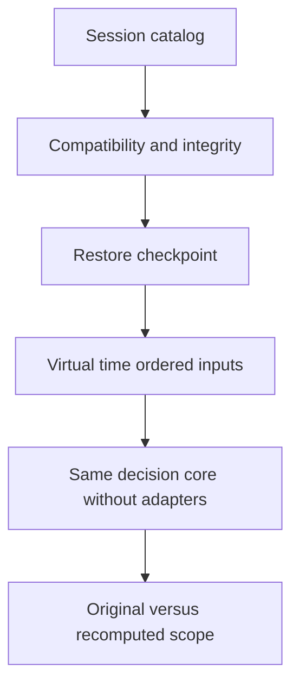
```mermaid
flowchart TD
  CAT["Session catalog"] --> CHECK["Compatibility and integrity"] --> CP["Restore checkpoint"] --> CLK["Virtual time ordered inputs"] --> CORE["Same decision core without adapters"] --> CMP["Original versus recomputed scope"]
```

## 21. Failure degradation

```mermaid
flowchart TD
  F["Detected fault"] --> DEP["Affected dependency set"] --> RED["Preserve or reduce capability"] --> LOG["State reason and evidence"]
  RED --> REC{"Fresh restoration and dwell?"}
  REC -->|No| HOLD["Remain degraded or inhibited"]
  REC -->|Yes| REVIEW["Restore only approved capability"]
```

## 22. Control-room data flow

```mermaid
flowchart TD
  EDGE["Local snapshots"] --> AUTH["Authenticated fleet API"] --> CACHE["Bounded latest state and history"] --> UI["React MapLibre views"]
  HIST["Immutable recordings"] --> REPLAY["Isolated replay UI"]
  UI --> CONTEXT["Reviewed mission or restriction request"]
  CONTEXT --> VALID["Local policy validation; no direct drive"]
```
