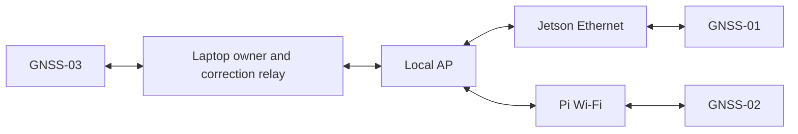

# 38 — Logical circuit and interconnections

NOT A FABRICATION/ENERGIZATION DRAWING. Logical names belong to R2 and do not rewrite legacy F1/F2/K1 nets. No new final GPIO, wire gauge, fuse value, pack voltage or connector polarity is invented. Every link is indexed in [02](02_HARDWARE_ICD.md).

## A. Compute/sensor data

```text
Jetson USB U1 <-> IWR1843BOOST XDS110 (separate qualified 5 V input)
Jetson USB U2 <-> B0200 UVC
Jetson USB U3 <-> verified ESP32 data port (binding pending)
Jetson USB U4 <-> UH720 upstream
  hub D1 <-> PureThermal-3 <-> Lepton keyed socket
  hub D2 <-> GNSS-01 rover A
  hub D3 <-> 11199 touch / one qualified power feed
Jetson SPI_SCLK -> BNO085 SCL
Jetson SPI_MISO <- BNO085 SDA
Jetson SPI_MOSI -> BNO085 DI
Jetson IMU_CS   -> BNO085 CS
Jetson IMU_INT  <- BNO085 INT
Jetson IMU_RST  -> BNO085 RST
N-R2-J3V3       -> BNO085 VIN; Jetson GND -> GND
```

Jetson physical header numbers are PHYSICAL PIN CONFIRMATION REQUIRED. BNO085 mode straps follow actual Adafruit SPI documentation; no default-I2C assumption. BNO085 SPI and wheel SPI are separate host buses. NVMe uses Jetson M.2 Key-M 2280.

## B. Motor control

```text
MOTOR_L_A [reported GPIO4 reservation] -> L298N IN1
MOTOR_L_B [reported GPIO5 reservation] -> L298N IN2
MOTOR_R_A [UNASSIGNED]                -> L298N IN3
MOTOR_R_B [UNASSIGNED]                -> L298N IN4
ESP reference -----------------------> verified L298N logic GND
Left bridge output pair -------------> actual two left TT connections, trace first
Right bridge output pair ------------> actual two right TT connections, trace first
```

GPIO16/GPIO17 NOT FROZEN. ENA/ENB jumpers currently reported installed: no claim of PWM speed control or reset-safe enable. Later MOTOR_L_ENABLE/MOTOR_R_ENABLE are logical requirements only, with reviewed fail-disabled circuitry and deliberate jumper/wiring change. Neither H-bridge motor terminal is assumed to be permanent ground.

## C. Wheel sensing

```text
ESP SPI_SCLK -> LEFT_SCLK and RIGHT_SCLK
ESP SPI_MOSI -> LEFT_MOSI and RIGHT_MOSI where selected profile needs it
ESP SPI_MISO <- selected LEFT_MISO or RIGHT_MISO (tri-state verified)
ENC_LEFT_CS -> left select; ENC_RIGHT_CS -> right select
Qualified local supply / GND -> each carrier per actual datasheet
```

Carrier/magnet mount PHYSICAL GEOMETRY DEPENDENT; supply rating remains unverified. Two selects never active together unless the actual protocol explicitly permits it. No quadrature A/B mapping is substituted.

## D. Network and E. GNSS



Each receiver uses its supplied active antenna and documented board bias; RF signal antenna→receiver, bias receiver→antenna. No added external bias. One owner multiplexes reads/correction writes. AP is not a source of clearance.

## F. Power and G. cutoff

```text
Electronics pack category
 -> F-E + protection -> N-R2-ELECTRONICS+
    -> qualified converter -> F-C19 -> N-R2-C19+ -> Jetson
    -> qualified converter -> F-H12 -> N-R2-H12+ -> hub
    -> qualified converter -> F-R5  -> N-R2-S5+  -> radar
    -> qualified converter -> F-N5  -> N-R2-N5+  -> AP
Peer protected source -> qualified 5 V -> F-P5 -> N-R2-P5+ -> Pi/rover B

Verified traction pack positive -> F-T -> N-R2-T-PROTECTED+
 -> manually operated rated latching cutoff -> N-R2-TRACTION+
 -> L298N motor-power input
Pack negative <- N-R2-TRACTION- <- L298N motor-current return
```

F-* are protection functions with ratings HOLD, not newly invented purchased components. Return bonds depend on actual converter/USB paths; no arbitrary IN-/OUT- short or galvanic-isolation claim. Motor current must not use logic/USB return conductors. Manual cutoff is independent of application/ESP/network. Reset is not rearm or a new command. No auxiliary cutoff contact/feedback wire is invented.

## H. HMI

Jetson DP → DP2HDMI2 → HDMI → 11199. USB touch/power follows one verified source, never parallel feeds. ESP BUZZER logical output → Grove SIG; qualified supply/GND → module power. GPIO not assigned. Display/buzzer do not grant authority; an alarm acknowledgement cannot reset a physical cutoff.

Full power, wire-rating, connector, sequence and protection gates: [04](04_POWER_ARCHITECTURE.md). Junctions must be explicit in future construction drawings; logical adjacency in these diagrams is not an electrical junction.
